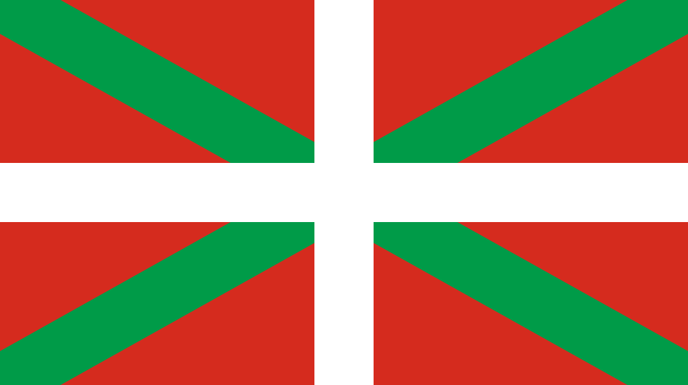

  

## Euskadle - wordle en euskara

Euskadle is a game inspired by the french TV show 'Motus' and its web version Wordle.

In this version of the game, the language used to play is Euskara, spoken in the Basque country.

## Contact 

Wanna talk about it ? Send me an email at [paulcourtoispaul@gmail.com](mailto:paulcourtoispaul@gmail.com)
